# QuizApp ✨📱🧠

  
  
  
  

  Modern, uçtan uca bir quiz uygulaması: yerel Android istemci ve FastAPI tabanlı backend. Öğretmen ve öğrenci rolleri, güvenli kimlik doğrulama, profil yönetimi ve Jetpack Compose ile modern bir arayüz sunar.

  Öne çıkan özellik: Öğretmenler yapay zeka ile saniyeler içinde quiz oluşturur, QR kod ile öğrencilerle anında paylaşır; öğrenciler soruları çözer ve hatalarını ayrıntılı analiz ekranında net biçimde görür.

  > Bu README'yi ekran görüntüleri ve GIF'lerle zenginleştirebilirsiniz. Ekran görüntülerini `docs/` klasörüne ekleyip buradan referanslayabilirsiniz.

## 📚 İçindekiler
- [Genel Bakış](#genel-bakış)
- [Özellikler](#özellikler)
- [Mimari](#mimari)
- [Teknoloji Yığını](#teknoloji-yığını)
- [Proje Yapısı](#proje-yapısı)
- [Başlarken](#başlarken)
  - [Önkoşullar](#önkoşullar)
  - [Backend Kurulumu (FastAPI)](#backend-kurulumu-fastapi)
  - [Android Uygulama Kurulumu](#android-uygulama-kurulumu)
- [Ortam Değişkenleri](#ortam-değişkenleri)
- [API Özeti](#api-özeti)
- [Ekran Görüntüleri](#ekran-görüntüleri)
- [Geliştirme Notları](#geliştirme-notları)
- [Sorun Giderme](#sorun-giderme)
- [Lisans](#lisans)

  ---

## 🧩 Genel Bakış
  QuizApp, öğretmenlerin quiz oluşturup yönetmesini; öğrencilerin ise quize katılıp soruları çözmesini ve sonuçlarını incelemesini sağlar. Android uygulaması modern, akıcı ve kullanıcı dostu bir arayüz sunar. Backend tarafı, kimlik doğrulama ve quiz akışları için token tabanlı sağlam API'ler sağlar.

  Uygulamanın en önemli özelliği: Yapay zeka ile çok hızlı quiz oluşturma + QR kod ile kolay paylaşım + öğrenciler için detaylı yanlış analizleri.

## 🔎 Ana Mantık: Yapay Zeka → QR Paylaşımı → Detaylı Analiz
  - **Yapay Zeka ile Quiz Oluşturma**: Öğretmen, konu/öğrenim hedeflerini girer; sistem yapay zeka ile saniyeler içinde kaliteli sorular ve seçenekler üretir.
  - **QR Kod ile Paylaşım**: Oluşturulan quiz otomatik olarak bir QR kodla temsil edilir. Öğretmen sınıfta QR'ı yansıtır veya paylaşır.
  - **Hızlı Katılım**: Öğrenciler Android uygulamasından QR'ı tarayıp quize anında katılır (alternatif: kodla katılım).
  - **Çözüm ve Zamanlama**: Zamanlayıcı ile sınav akışı yönetilir; süre bitiminde otomatik gönderim yapılır.
  - **Detaylı Hata Analizi**: Sonuçlar ekranında her soru için seçilen seçenek, doğru cevap ve açıklamalar gösterilir; öğrenci güçlü/zayıf yönlerini görür.

  Bu akış, öğretmenin hazırlık süresini minimuma indirirken öğrencilerin öğrenme verimini artırmayı hedefler.

## ⭐ Özellikler
  - ✅ Öğretmen ve Öğrenci rolleri
  - 🤖 Yapay zeka ile hızlı quiz oluşturma (saniyeler içinde)
  - 📱 QR kod ile quiz paylaşımı ve hızlı katılım
  - 🔐 Güvenli kimlik doğrulama (Bearer token)
  - 👤 Profil görüntüleme/düzenleme (her iki rol için)
  - 📝 Quiz oluşturma, listeleme, katılma
  - ⏱️ Geri sayım sayacı + süre dolduğunda otomatik gönderim
  - 📊 Sonuç özeti + soru bazlı detaylı inceleme
  - 🗂️ Öğrenci çözüm geçmişi (yeniden eskiye)
  - 🎨 Modern UI (gradyanlar, kartlar, ikonlar)

## 🏗️ Mimari
  - 🔹 İstemci ve sunucu ayrımı (temiz katmanlar)
  - 🔹 Android tarafında MVVM + Repository yapısı
  - 🔹 Backend: FastAPI + SQLAlchemy + Pydantic
  - 🔹 Bearer token ile güvenli, stateless API'ler

  ```mermaid
  flowchart LR
    A[Android App - Jetpack Compose] -->|HTTPS| B[FastAPI Backend]
    B --> C[Database]
    A <--> D[Local Storage - SharedPreferences]
  ```

## 🛠️ Teknoloji Yığını
  - Android: Kotlin, Jetpack Compose, Material 3, Navigation, ViewModel, Coroutines, Retrofit (veya benzeri), SharedPreferences
  - Backend: Python, FastAPI, SQLAlchemy, Pydantic, Uvicorn
  - Araçlar: Gradle, pip/venv, Git

## 🗂️ Proje Yapısı
  ```
  quizapp/
  ├─ android/          # Android application (Jetpack Compose)
  │  ├─ app/
  │  └─ ...
  ├─ backend/          # FastAPI application
  │  ├─ app/
  │  │  ├─ main.py
  │  │  ├─ api/
  │  │  ├─ models/
  │  │  ├─ schemas/
  │  │  └─ services/
  │  └─ requirements.txt
  └─ README.md         # You are here
  ```

## 🚀 Başlarken

### ✅ Önkoşullar
  - Android Studio (Giraffe/Flamingo veya üzeri)
  - JDK 17 (güncel Android Gradle Plugin için önerilir)
  - Python 3.10+
  - Git

### 🧪 Backend Kurulumu (FastAPI)
  1. Python sanal ortam oluşturun ve etkinleştirin:
    ```bash
    cd backend
    python -m venv .venv
    # Windows
    .venv\Scripts\activate
    # macOS/Linux
    source .venv/bin/activate
    ```
  2. Bağımlılıkları yükleyin:
    ```bash
    pip install -r requirements.txt
    ```
  3. Ortam değişkenlerini yapılandırın ([Ortam Değişkenleri](#-ortam-değişkenleri) bölümüne bakın).
  4. Sunucuyu çalıştırın (auto-reload):
    ```bash
    uvicorn app.main:app --reload --host 0.0.0.0 --port 8000
    ```
  5. API dokümantasyonunu açın:
    - Swagger UI: http://localhost:8000/docs
    - ReDoc: http://localhost:8000/redoc

### 📱 Android Uygulama Kurulumu
  1. `android/` klasörünü Android Studio ile açın.
  2. Gradle senkronize edin ve projeyi derleyin.
  3. Backend için `BASE_URL` değerini ayarlayın (ör. sabitler dosyası veya build config). Emulator kullanıyorsanız:
    - Android Emulator'dan host makineye: `http://10.0.2.2:8000`
  4. Uygulamayı cihazda veya emulatörde çalıştırın.

## 🔐 Ortam Değişkenleri
  Backend (örnekler; ihtiyacınıza göre güncelleyin):
  - `DATABASE_URL`: SQLAlchemy bağlantı dizesi (ör. `sqlite:///./quiz.db` veya PostgreSQL URL)
  - `SECRET_KEY`: JWT gizli anahtarı
  - `ACCESS_TOKEN_EXPIRE_MINUTES`: Token geçerlilik süresi (ör. `60`)
  - `CORS_ORIGINS`: İzin verilen origin'ler (ör. `http://localhost:3000,http://10.0.2.2:8000`)

  Android:
  - `BASE_URL`: Backend ana URL. Emulator için örnek: `http://10.0.2.2:8000`
  - Tokenlar `SharedPreferences` içinde saklanır (`quiz_app_prefs` altında `access_token`).

## 🔗 API Özeti
  Önemli uç noktalar (temsili; tam liste için Swagger'a bakın):
  - Auth
    - `POST /auth/login`
    - `POST /auth/register`
  - Profil
    - `GET /users/me`
    - `PUT /users/me`
  - Quizzes
    - `GET /quizzes` (listeleme)
    - `POST /quizzes` (öğretmen)
    - `GET /quizzes/{id}` (soru detayları ile)
    - `POST /quizzes/{id}/submit` (cevapları gönder)
  - Öğrenci
    - `GET /students/me/solved-quizzes` (geçmiş)
    - `GET /students/me/results/{quiz_id}` (detaylı sonuç)

  Tüm korumalı uç noktalar `Authorization: Bearer <token>` başlığı gerektirir.

## 🖼️ Ekran Görüntüleri
Görseller `screens/` klasörü içinde tutulacaktır. Aşağıda README’de referanslanan başlıklar ve dosyalar yer almaktadır.

> İpucu: Tutarlı cihaz çerçeveleri ve karanlık modu tercih ederek şık bir görünüm elde edin.

<table>
  <tr>
    <td align="center">
      <a href="screens/login.png" target="_blank">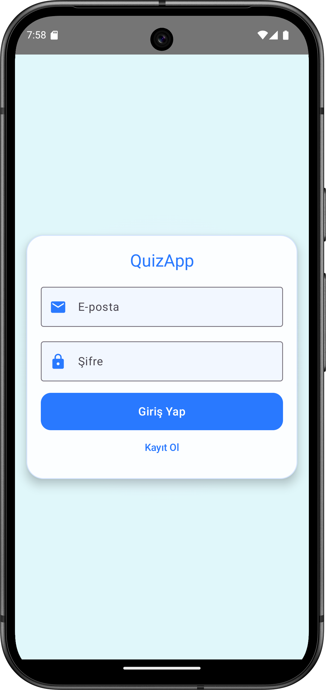</a>
      <div><sub>Giriş (Login)</sub></div>
    </td>
    <td align="center">
      <a href="screens/register.png" target="_blank">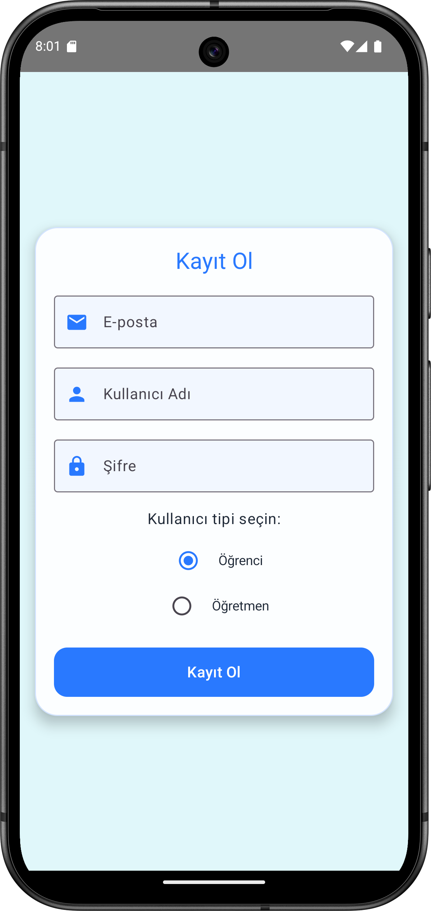</a>
      <div><sub>Kayıt (Register)</sub></div>
    </td>
  </tr>
  <tr>
    <td align="center">
      <a href="screens/profile.png" target="_blank">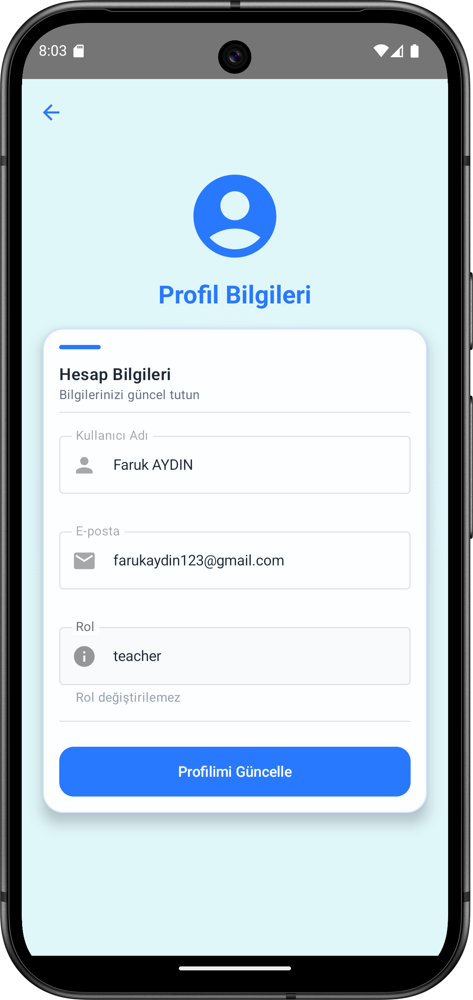</a>
      <div><sub>Profil</sub></div>
    </td>
    <td align="center">
      <a href="screens/teacherHome.png" target="_blank">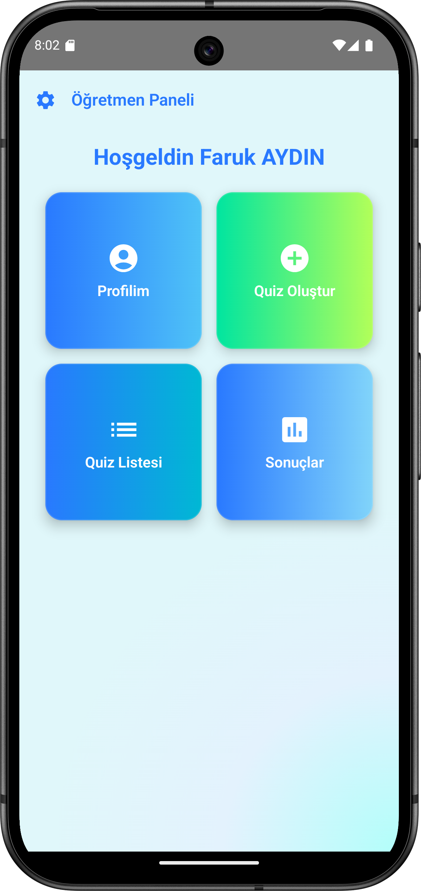</a>
      <div><sub>Öğretmen Ana Ekranı</sub></div>
    </td>
  </tr>
  <tr>
    <td align="center">
      <a href="screens/createQuiz.png" target="_blank">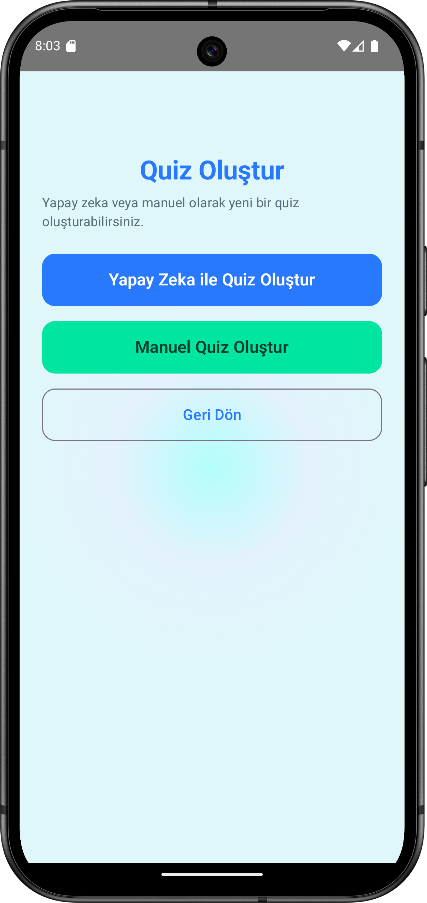</a>
      <div><sub>Quiz Oluştur (Menü)</sub></div>
    </td>
    <td align="center">
      <a href="screens/AICreateQuiz.png" target="_blank">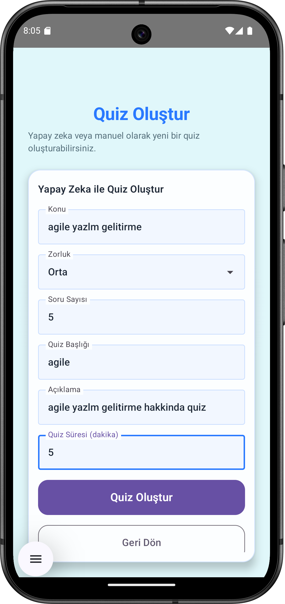</a>
      <div><sub>Yapay Zeka ile Quiz Oluşturma</sub></div>
    </td>
  </tr>
  <tr>
    <td align="center">
      <a href="screens/manuelCreateQuiz.png" target="_blank">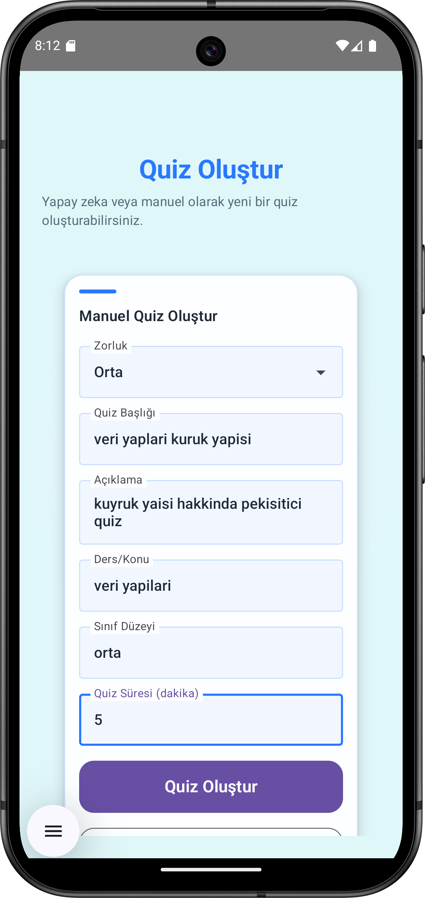</a>
      <div><sub>Manuel Quiz Oluşturma</sub></div>
    </td>
    <td align="center">
      <a href="screens/quizList.png" target="_blank">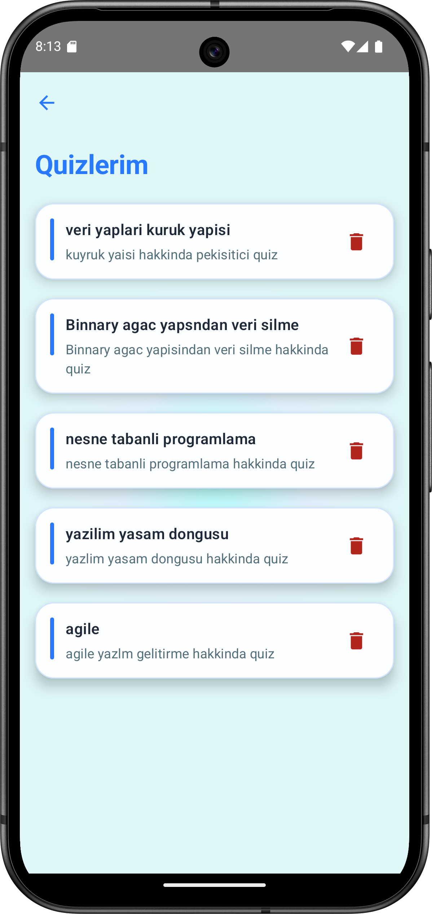</a>
      <div><sub>Quiz Listesi (Öğretmen)</sub></div>
    </td>
  </tr>
  <tr>
    <td align="center">
      <a href="screens/quizDetail1.png" target="_blank">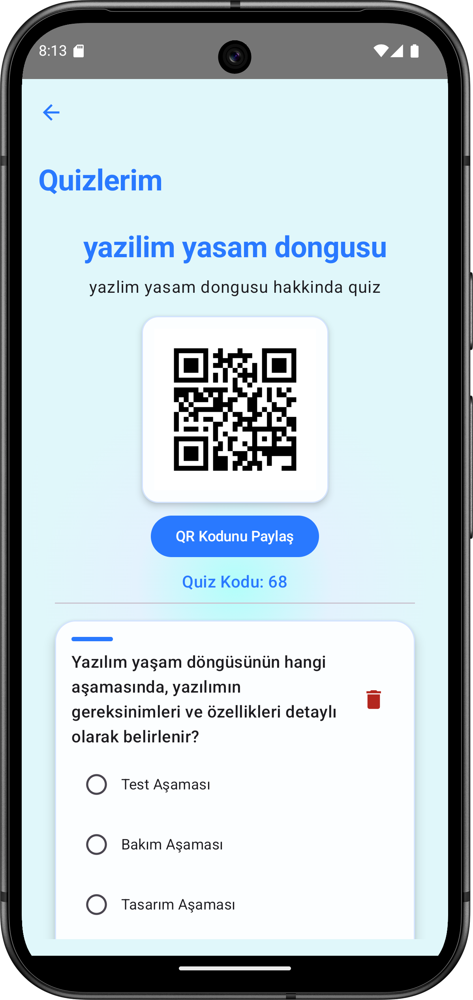</a>
      <div><sub>Quiz Detayı 1</sub></div>
    </td>
    <td align="center">
      <a href="screens/quizDetail2.png" target="_blank">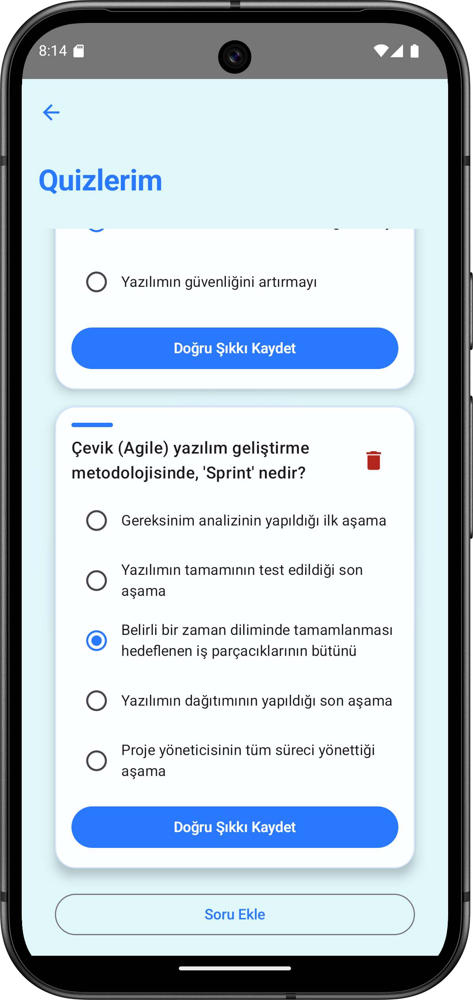</a>
      <div><sub>Quiz Detayı 2</sub></div>
    </td>
  </tr>
  <tr>
    <td align="center">
      <a href="screens/teacherQuizResultList.png" target="_blank">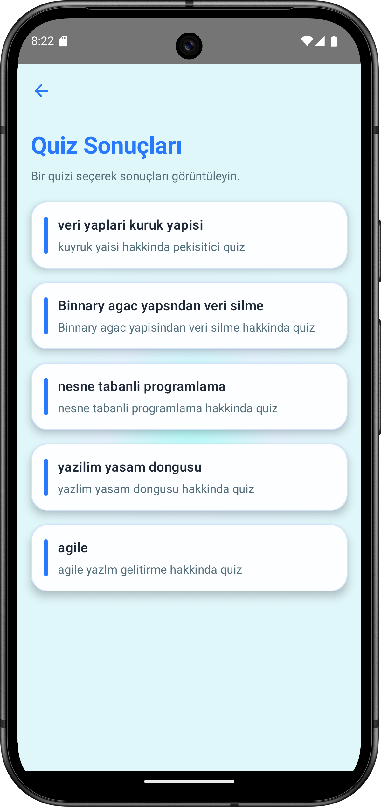</a>
      <div><sub>Öğretmen Quiz Sonuç Listesi</sub></div>
    </td>
    <td align="center">
      <a href="screens/teacherDetailResult1.png" target="_blank">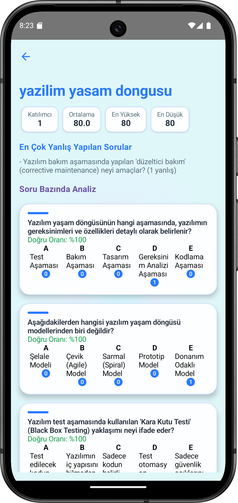</a>
      <div><sub>Öğretmen Detaylı Sonuç 1</sub></div>
    </td>
  </tr>
  <tr>
    <td align="center">
      <a href="screens/teacherDetailResult2.png" target="_blank"></a>
      <div><sub>Öğretmen Detaylı Sonuç 2</sub></div>
    </td>
    <td align="center">
      <a href="screens/studentHome.png" target="_blank">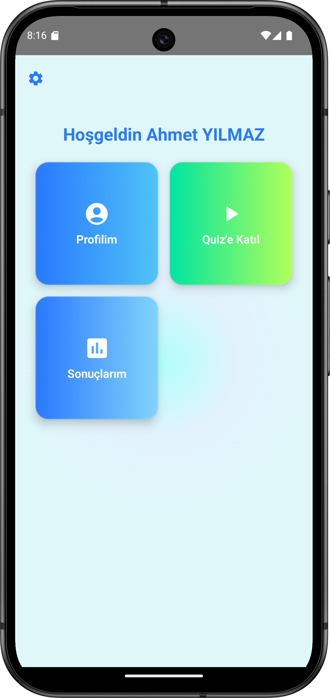</a>
      <div><sub>Öğrenci Ana Ekranı</sub></div>
    </td>
  </tr>
  <tr>
    <td align="center">
      <a href="screens/joinQuiz.png" target="_blank">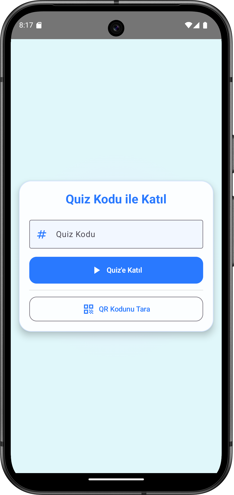</a>
      <div><sub>Quiz'e Katıl</sub></div>
    </td>
    <td align="center">
      <a href="screens/solveQuiz.png" target="_blank">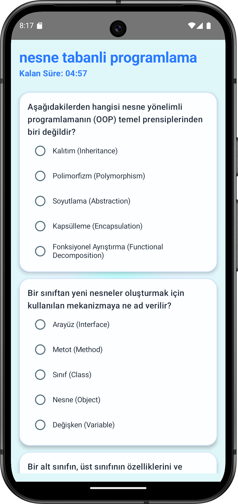</a>
      <div><sub>Quiz Çöz / Zamanlayıcı</sub></div>
    </td>
  </tr>
  <tr>
    <td align="center">
      <a href="screens/studentResult.png" target="_blank">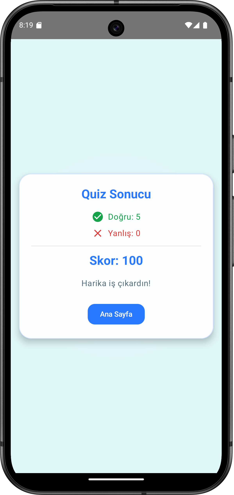</a>
      <div><sub>Öğrenci Sonuç Özeti</sub></div>
    </td>
    <td align="center">
      <a href="screens/studentSolvedQuizList.png" target="_blank">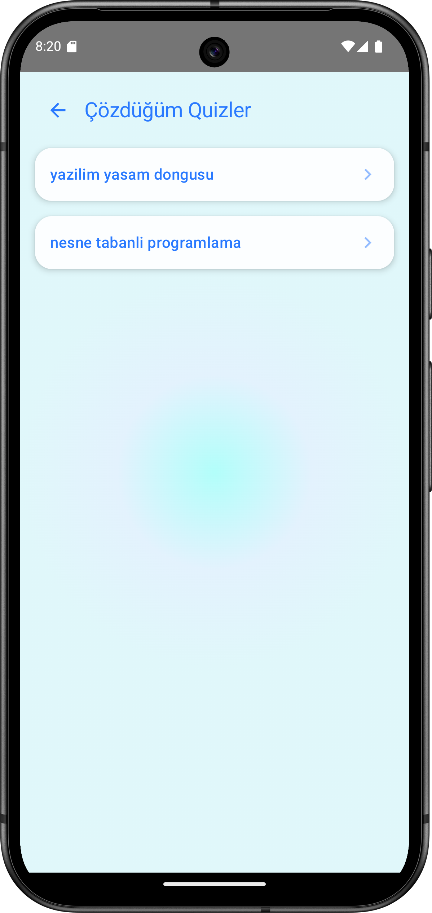</a>
      <div><sub>Öğrenci Çözüm Geçmişi</sub></div>
    </td>
  </tr>
  <tr>
    <td align="center">
      <a href="screens/studentDetailResult.png" target="_blank">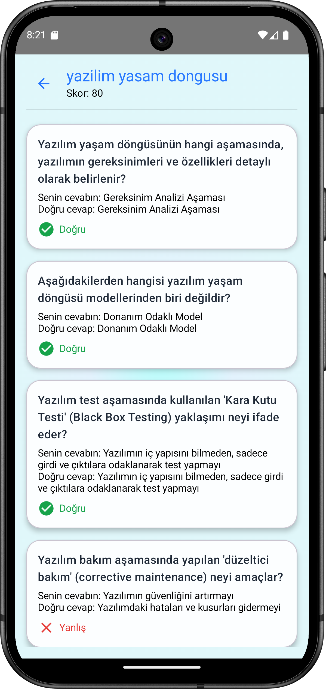</a>
      <div><sub>Öğrenci Soru Bazlı Detay</sub></div>
    </td>
    <td align="center">
      
    </td>
  </tr>
</table>

## 🧠 Geliştirme Notları
  - Arayüz, modern görünüm için Compose Material 3 ve gradyan arkaplanlar kullanır.
  - Gezinti `NavController` ile yönetilir; ekranlar sistem geri tuşunu doğal olarak destekler.
  - Token, `SharedPreferences` içinde `quiz_app_prefs` altında `access_token` olarak saklanır.
  - Bazı Compose API'leri deneyseldir; gerektiğinde opt‑in edilir.
  - Min SDK 24+; daha geniş uyumluluk için tarih ayrıştırmada dikkatli desenler kullanılır.

## 🧯 Sorun Giderme
  - **Bağlantı (Android → Backend)**
    - Emulator'dan host makineye `10.0.2.2` kullanın.
    - CORS ve sunucu bind adresini kontrol edin.
  - **Kimlik Doğrulama**
    - Token yok/expired → Yeniden giriş yapın; token'ın `SharedPreferences`'ta saklandığını doğrulayın.
  - **Compose Deneysel API'ler**
    - Gerekli yerlerde `@OptIn(ExperimentalMaterial3Api::class)` ekleyin.
  - **Tarih Ayrıştırma**
    - ISO (zaman dilimli/dilimsiz) ve epoch sn/ms desteklenir. Backend farklıysa `StudentSolvedQuizListScreen.kt` içindeki desenleri güncelleyin.

## 📄 Lisans
  Bu proje MIT Lisansı ile lisanslanmıştır. Ayrıntılar için `LICENSE` dosyasına bakın.
